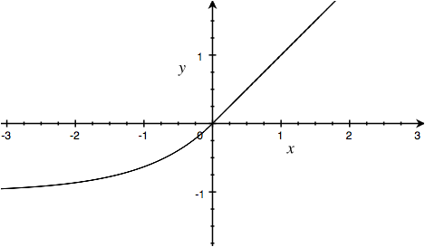
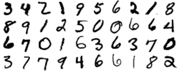

# Deep Learning Glossary

Simple, opinionated explanations of various things encountered in
Deep Learning / AI / ML. 

Contributions welcome - there may be errors here!


### AlexNet

Winner of ILSVRC 2012. Made a huge jump in accuracy using CNN. 
Uses Dropout, ReLUs, and a GPU.

Kind of the canonical deep convolution net.

http://papers.nips.cc/paper/4824-imagenet-classification-with-deep-convolutional-neural-networks


### Adversarial Networks

For generative networks (that is networks that produce high dimensional data like images or sound)
typical loss functions cannot express the complexity of the data. Goodfellow et al proposed a scheme
where you train two networks: the generator and the discriminator. The generator tries to fool the
discriminator into think it's producing real data. The discriminator outputs a single probability
deciding if it got input from the dataset or from the generator.

[Generative Adversarial Networks](http://arxiv.org/abs/1406.2661) (2014)

[Adversarial Autoencoders](http://arxiv.org/abs/1511.05644) (2015)


### Attention

Not well defined. The idea of processing only part of the input at each time
step. In visual attention, this is a low resolution window that jumps around
the high resolution input image. Determining where to focus attention is
controlled by a RNN. 

Typical convolutional networks have input around 300 x 300 inputs, which is
rather low resolution. Computation complexity grows at least linearly in the
number of pixel inputs.  Attention models seem like a promising method of
handling larger inputs.

[Recurrent Models of Visual Attention](http://arxiv.org/abs/1406.6247) Attention applied to MNIST.

[Multiple Object Recognition with Visual Attention](http://arxiv.org/abs/1412.7755) Essentially v2 of the above model.

[DRAW: A Recurrent Neural Network For Image Generation](http://arxiv.org/abs/1502.04623) A generative attention model


### Batch Normialization (BN)

Normalizing the inputs to each activation function can dramatically speed up
learning.

[Ioffe & Szegedy, 2015](http://arxiv.org/abs/1502.03167)


### CIFAR-10 Dataset

60000 32x32 colour images in 10 classes, with 6000 images per class. There are
50000 training images and 10000 test images. 

There's also a CIFAR-100 with 100 classes.

https://www.cs.toronto.edu/~kriz/cifar.html


### Convolutional Neural Network (CNN)

This is the best intro: http://cs231n.github.io/convolutional-networks/ 

[LeCun demoing one in '93](https://www.youtube.com/watch?v=FwFduRA_L6Q)


### Deep Q Network (DQN)

The atari playing model. This is the closest thing to a real "AI" out there. It learns
end-to-end from its input and makes actions. 

(Volodymyr Mnih Koray Kavukcuoglu David Silver Alex Graves Ioannis Antonoglou
Daan Wierstra Martin Riedmiller)


### Discriminative Model

A model that outputs a category based on its input. As opposed to generative model.

Image classification systems are discriminative.


### Dropout

Introduced in AlexNet? Randomly zero out 50% of inputs during the forward pass.
Simple regularizer.


### Exponential Linear Units (ELUs)

Another activiation function designed to avoid vanishing gradients.

```
elu(x) = x          when x >= 0
         exp(x) - 1 when x < 0
```



[Clevert, Unterthiner, Hochreiter 2015](http://arxiv.org/abs/1511.07289)


### FTRL-proximal algorithm, Follow-the-regularized-leader

[Google, 2013](https://www.eecs.tufts.edu/~dsculley/papers/ad-click-prediction.pdf)


### Generative Model

A model that produces output like the dataset it is training on. As opposed to a discriminative model.

A model that creates images or sound would be a generative model.


### Grid-LSTM

(Kalchbrenner et al., 2015)


### IAM Handwriting Dataset

http://www.iam.unibe.ch/fki/databases/iam-handwriting-database

Famously used in Graves's handwriting generation RNN: http://www.cs.toronto.edu/~graves/handwriting.html

http://yann.lecun.com/exdb/mnist/


### ImageNet Large Scale Visual Recognition Competition  (ILSVRC)

The most prominent computer vision contest, using the largest data set of images (ImageNet).
The progress in the classification task has brought CNNs to dominate the field of computer vision.

| Year          | Model                     | Top-5 Error | Layers | Paper
| ------------- |:-------------------------:| -----------:|-------:|------------------------------
| 2012          | AlexNet                   |     17.0 %  |      8 | http://papers.nips.cc/paper/4824-imagenet-classification-with-deep-convolutional-neural-networks
| 2013          | ZFNet                     |     17.0 %  |      8 | http://arxiv.org/abs/1311.2901
| 2014          | VGG-19                    |      8.43%  |     19 | http://arxiv.org/abs/1409.1556
| 2014          | GoogLeNet / Inception     |      7.89%  |     22 | http://arxiv.org/abs/1409.4842
| 2015          | Inception v3              |      5.6%   |        | http://arxiv.org/abs/1512.00567
| 2015          | ResNet                    |      4.49%  |    152 | http://arxiv.org/abs/1512.03385


### ImageNet dataset

Largest image dataset. Each image is tagged with a WordNet nouns. One of the
key peices in the CNN progress along with GPUs and dedicated researchers.

### Leaky ReLU 

Variation on ReLU that some have success with.

```
leaky_relu(x) = x          when x >= 0
                0.01 * x   when x < 0
```


### Long Short Term Memory (LSTM)

A type of RNN that solves the exploding/vanishing gradient problem.

http://colah.github.io/posts/2015-08-Understanding-LSTMs/

[This paper](http://arxiv.org/abs/1503.04069) is a great exploration of
variations. Concludes that [vanilla LSTM](http://www.sciencedirect.com/science/article/pii/S0893608005001206) is best.

Originally invented by [Hochreiter & Schmidhuber, 1997](http://deeplearning.cs.cmu.edu/pdfs/Hochreiter97_lstm.pdf)


### MNIST dataset

Handwritten digits. 28x28 images. 60,000 training images and 10,000 testing images




### Momentum 

Momentum is an often used improvement to SGD - follow past gradients with some
weight.


### Neural Random-Access Machine (NRAM)

Essentially v2 of NTM.

[Kurach, Andrychowicz, Sutskever, 2015](http://arxiv.org/pdf/1511.06392v1)


### Neural Turing Machine (NTM)

(Graves et al., 2014)


### Parametric Rectified Linear Unit (PReLU)

http://arxiv.org/pdf/1502.01852v1


### Rectified Linear Unit (ReLU)

Rectified linear unit is a common activation function which was first proved useful in AlexNet.
Recommend over sigmoid activiation.

```
relu(x) = max(x, 0)
```

[Nair & Hinton, 2010](http://www.cs.toronto.edu/~fritz/absps/reluICML.pdf)


### ResNet

A Microsoft Research model that won several categories of ILSVRC 2015.
The key insight is that as networks get deeper they can get worse, by adding
identify short cut connections over every two convolutional layers they are 
able to improve performance up to a 152 layer deep network. 
Here is a table from the paper that roughly shows the architectures they tried


[Kaiming He, Xiangyu Zhang, Shaoqing Ren, Jian Sun, 2015](http://arxiv.org/abs/1512.03385)


### R-CNN, Regions with Convolutional Neural Networks

Object detection model.

Girshick et al., 2014


### Stochastic Gradient Descent (SGD)

The original and simpliest back propagation optimization algorithm. Still used everywhere!


### TIMIT Speech database 

(Garofolo et al., 1993) 


### VGG-16 / VGG-19

Close second place winner in ILSVRC 2014. Very simple CNN architecure using only
3x3 convolutions, max pooling, ReLUs, dropout


